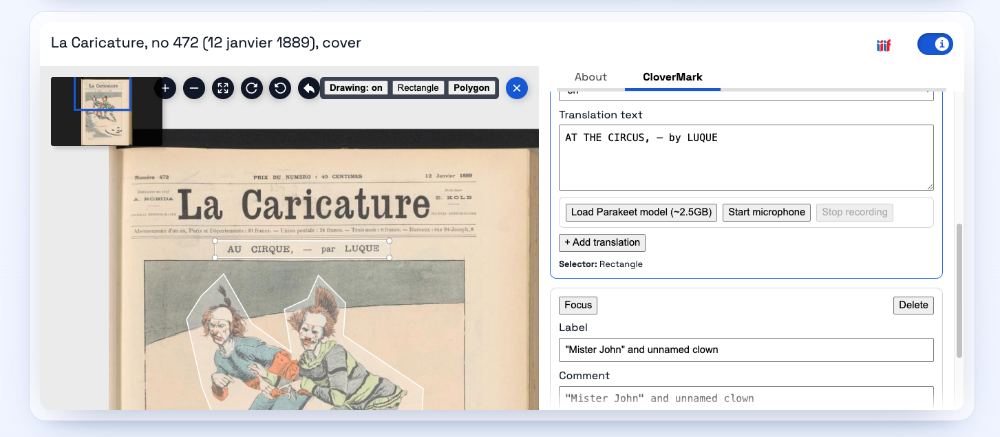
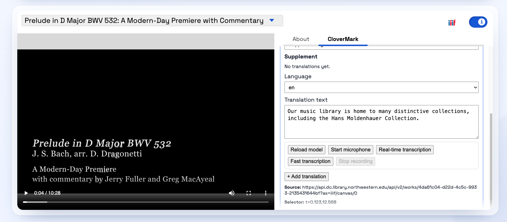
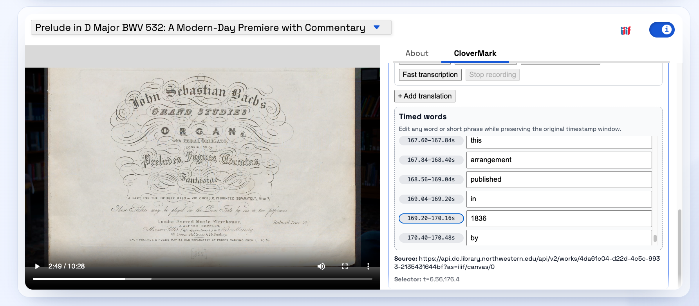

# CloverMark Plugin

A plugin for [`@samvera/clover-iiif`](https://www.npmjs.com/package/@samvera/clover-iiif) that adds
annotation tooling for image, audio, and video canvases.

It provides:
- OpenSeadragon drawing tools for image canvases
- an information panel for managing CloverMarks
- multilingual supplementing/translating text bodies
- IIIF AnnotationPage export for session annotations
- optional in-browser streaming speech-to-text for AV workflows using the Parakeet runtime and models

## Install

In a Clover host app, install Clover and this plugin:

```bash
npm install @samvera/clover-iiif@latest @nulib/clover-mark-plugin
```

`@samvera/clover-iiif` is a peer dependency (`>=3.3.8 <5`) so the host app controls Clover versioning.

## Screenshots
Image canvas workflow showing drawing tools, annotation targeting, and CloverMark panel editing in one view.


Audiovisual workflow with model loading, microphone controls, and transcription/translation editing in the CloverMark tab.


Word-level timestamp editing for timed transcription output while preserving each token's original time window.


## How To Use In A Clover App

Use the plugin as a named import in your React app:

```tsx
import React, { useMemo, useState } from "react";
import Viewer from "@samvera/clover-iiif/viewer";
import { initCloverI18n } from "@samvera/clover-iiif/i18n";
import { cloverMarkPlugin } from "@nulib/clover-mark-plugin";

const MOTIVATION_OPTIONS = [
  "commenting",
  "highlighting",
  "tagging",
  "supplementing",
] as const;
const TRANSLATION_LANGUAGE_OPTIONS = ["en", "fr", "es", "ht", "ar"] as const;

type MotivationOption = (typeof MOTIVATION_OPTIONS)[number];
type TranslationLanguageOption = (typeof TRANSLATION_LANGUAGE_OPTIONS)[number];

export function ManifestViewer({ manifestUrl }: { manifestUrl: string }) {
  const i18n = useMemo(() => initCloverI18n(), []);
  const [language, setLanguage] = useState("en");
  const defaultMotivation: MotivationOption = "supplementing";
  const defaultTranslationLanguage: TranslationLanguageOption = "en";

  const plugins = useMemo(
    () => [
      cloverMarkPlugin({
        id: "clover-mark",
        defaultMotivation,
        motivationOptions: [...MOTIVATION_OPTIONS],
        translationLanguageOptions: [...TRANSLATION_LANGUAGE_OPTIONS],
        defaultTranslationLanguage,
        enableStreamingStt: true,
        tabLabelByLanguage: {
          en: "CloverMark",
          es: "CloverMark",
          fr: "CloverMark (francais)",
        },
        translations: {
          es: {
            tabLabel: "CloverMark",
            motivationCommenting: "Comentario",
            motivationHighlighting: "Resaltado",
            motivationDescribing: "Descripcion",
            motivationTranscribing: "Transcripcion",
            motivationTranslating: "Traduccion",
            motivationTagging: "Etiquetado",
            motivationSupplementing: "Suplemento",
          },
          fr: {
            tabLabel: "CloverMark (francais)",
            motivationCommenting: "Commentaire",
            motivationHighlighting: "Surlignage",
            motivationDescribing: "Description",
            motivationTranscribing: "Transcription",
            motivationTranslating: "Traduction",
            motivationTagging: "Etiquetage",
            motivationSupplementing: "Complement",
          },
        },
      }),
    ],
    [],
  );

  return (
    <>
      <label htmlFor="viewer-language">Viewer language</label>
      <select
        id="viewer-language"
        value={language}
        onChange={(event) => {
          const nextLanguage = event.target.value;
          setLanguage(nextLanguage);
          void i18n.changeLanguage(nextLanguage);
        }}
      >
        <option value="en">English</option>
        <option value="fr">French</option>
        <option value="es">Spanish</option>
      </select>
      <Viewer
        iiifContent={manifestUrl}
        plugins={plugins}
        options={{
          informationPanel: {
            open: true,
            defaultTab: "clover-mark",
          },
          showTitle: true,
        }}
      />
    </>
  );
}
```

`cloverMarkPlugin` is a named export. Use:

```tsx
import { cloverMarkPlugin } from "@nulib/clover-mark-plugin";
```

Do not use a default import (`import cloverMarkPlugin from ...`).

Plugin options:

- `id` (optional): custom plugin id. Default: `clover-mark`.
- `enableImageDrawing` (optional): set `false` to disable OpenSeadragon drawing controls. Default: enabled.
- `defaultMotivation` (optional): default annotation motivation. Default: `supplementing`.
- `motivationOptions` (optional): allowed motivations in the panel.
- `translationLanguageOptions` (optional): selectable translation languages. Default fallback: `["en", "fr", "es"]`.
- `defaultTranslationLanguage` (optional): default translation language for new draft text.
- `enableStreamingStt` (optional): set `false` to disable streaming speech-to-text UI. Default: enabled.
- `sttModelVersion` (optional): Parakeet model id. Default: `parakeet-tdt-0.6b-v3`.
- `sttUpdateIntervalMs` (optional): streaming update cadence (minimum `250ms`). Default: `500ms`.
- `tabLabel` (optional): fallback information panel label (`none` locale). Default: `CloverMark`.
- `tabLabelByLanguage` (optional): localized information panel labels by language code.
- `translations` (optional): i18n translation overrides/additions by language code.

## i18n Notes

- Clover controls active language through i18next.
- This plugin registers its own namespace: `CloverMark`.
- Built-in strings are included for `en`, `fr`, and `es`.
- Provide `translations` to override or extend strings for your locales.

Common translation keys:

- `tabLabel`
- `sessionCloverMarks`, `noSessionCloverMarks`
- `scholiumLabel`, `scholiumComment`, `motivation`
- `translationLanguage`, `translationText`, `translationAdd`, `translationDelete`
- `drawingOn`, `drawingOff`, `drawingRectangle`, `drawingPolygon`
- `exportAnnotations`, `exportNoAnnotations`, `exportSuccess`
- `sttLoadModel`, `sttStartRecording`, `sttStartViewer`, `sttStartViewerFast`, `sttStopRecording`
- `sttStatus`, `sttModelStateReady`, `sttStreamingError`, `sttViewerUnavailable`

## Features

- Adds an information panel tab for CloverMark session management
- Adds drawing controls (rectangle/polygon) for image canvases
- Supports annotation editing for image and AV canvases
- Supports translation bodies with per-translation language codes
- Supports quick-start viewer and microphone transcription workflows
- Captures timed words from STT and supports timestamp seeking/editing
- Exports current session annotations as a IIIF Presentation 3 AnnotationPage
- Includes built-in English, French, and Spanish UI strings

## Development

```bash
npm install
```

Run local dev viewer (Vite, port `3003`):

```bash
npm run dev
```

Build distributable output (`dist/`, ESM + CJS + types):

```bash
npm run build
```

Watch library build:

```bash
npm run watch
```

Type-check:

```bash
npm run typecheck
```

Run tests:

```bash
npm run test
```

## Publish

```bash
npm publish
```

The `prepublishOnly` script runs `typecheck` and `build` before publish.

## Notes

- Streaming STT is fully client-side and loads the Parakeet runtime/model on demand.
- Default STT model: `parakeet-tdt-0.6b-v3` (large download, about `2.5GB`).
- Session annotations are kept in runtime state; export captures the current in-memory session.
