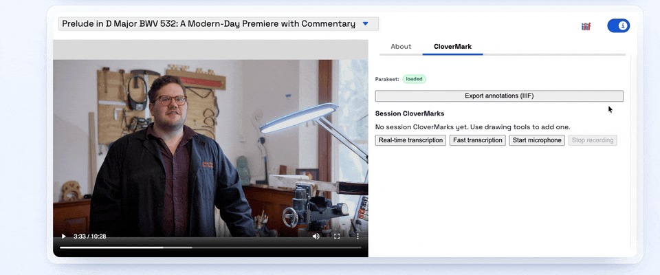

# CloverMark Plugin

A plugin for [`@samvera/clover-iiif`](https://www.npmjs.com/package/@samvera/clover-iiif) that adds
annotation tooling for image, audio, and video canvases.

It provides:
- OpenSeadragon drawing tools for image canvases
- an information panel for managing CloverMarks
- multilingual supplementing/translating text bodies
- IIIF AnnotationPage export for session annotations
- optional in-browser streaming speech-to-text for AV workflows using the Parakeet runtime and models

## Install

In a Clover host app, install Clover and this plugin:

```bash
npm install @samvera/clover-iiif@latest @nulib/clover-mark-plugin
```

`@samvera/clover-iiif` is a peer dependency (`>=3.3.8 <5`) so the host app controls Clover versioning.

## Screenshots




## How To Use In A Clover App

Register the plugin with your Clover viewer:

```tsx
import Viewer from "@samvera/clover-iiif/viewer";
import { cloverMarkPlugin } from "@nulib/clover-mark-plugin";

const plugins = [
  cloverMarkPlugin({
    id: "clover-mark",
    defaultMotivation: "supplementing",
    motivationOptions: ["commenting", "transcribing", "highlighting", "tagging", "supplementing"],
    translationLanguageOptions: ["en", "fr", "es", "ht"],
    defaultTranslationLanguage: "en",
    enableStreamingStt: true,
    tabLabelByLanguage: {
      en: "CloverMark",
      fr: "CloverMark (francais)",
      es: "CloverMark (espanol)",
    },
    translations: {
      fr: {
        tabLabel: "CloverMark (francais)",
      },
      es: {
        tabLabel: "CloverMark (espanol)",
      },
    },
  }),
];

export function ManifestViewer({ manifestUrl }: { manifestUrl: string }) {
  return (
    <Viewer
      iiifContent={manifestUrl}
      plugins={plugins}
      options={{
        informationPanel: { open: true },
      }}
    />
  );
}
```

Plugin options:

- `id` (optional): custom plugin id. Default: `clover-mark`.
- `enableImageDrawing` (optional): set `false` to disable OpenSeadragon drawing controls. Default: enabled.
- `defaultMotivation` (optional): default annotation motivation. Default: `supplementing`.
- `motivationOptions` (optional): allowed motivations in the panel.
- `translationLanguageOptions` (optional): selectable translation languages. Default fallback: `["en", "fr", "es"]`.
- `defaultTranslationLanguage` (optional): default translation language for new draft text.
- `enableStreamingStt` (optional): set `false` to disable streaming speech-to-text UI. Default: enabled.
- `sttModelVersion` (optional): Parakeet model id. Default: `parakeet-tdt-0.6b-v3`.
- `sttUpdateIntervalMs` (optional): streaming update cadence (minimum `250ms`). Default: `500ms`.
- `tabLabel` (optional): fallback information panel label (`none` locale). Default: `CloverMark`.
- `tabLabelByLanguage` (optional): localized information panel labels by language code.
- `translations` (optional): i18n translation overrides/additions by language code.

## i18n Notes

- Clover controls active language through i18next.
- This plugin registers its own namespace: `CloverMark`.
- Built-in strings are included for `en`, `fr`, and `es`.
- Provide `translations` to override or extend strings for your locales.

Common translation keys:

- `tabLabel`
- `sessionCloverMarks`, `noSessionCloverMarks`
- `scholiumLabel`, `scholiumComment`, `motivation`
- `translationLanguage`, `translationText`, `translationAdd`, `translationDelete`
- `drawingOn`, `drawingOff`, `drawingRectangle`, `drawingPolygon`
- `exportAnnotations`, `exportNoAnnotations`, `exportSuccess`
- `sttLoadModel`, `sttStartRecording`, `sttStartViewer`, `sttStartViewerFast`, `sttStopRecording`
- `sttStatus`, `sttModelStateReady`, `sttStreamingError`, `sttViewerUnavailable`

## Features

- Adds an information panel tab for CloverMark session management
- Adds drawing controls (rectangle/polygon) for image canvases
- Supports annotation editing for image and AV canvases
- Supports translation bodies with per-translation language codes
- Supports quick-start viewer and microphone transcription workflows
- Captures timed words from STT and supports timestamp seeking/editing
- Exports current session annotations as a IIIF Presentation 3 AnnotationPage
- Includes built-in English, French, and Spanish UI strings

## Development

```bash
npm install
```

Run local dev viewer (Vite, port `3003`):

```bash
npm run dev
```

Build distributable output (`dist/`, ESM + CJS + types):

```bash
npm run build
```

Watch library build:

```bash
npm run watch
```

Type-check:

```bash
npm run typecheck
```

Run tests:

```bash
npm run test
```

## Publish

```bash
npm publish
```

The `prepublishOnly` script runs `typecheck` and `build` before publish.

## Notes

- Streaming STT is fully client-side and loads the Parakeet runtime/model on demand.
- Default STT model: `parakeet-tdt-0.6b-v3` (large download, about `2.5GB`).
- Session annotations are kept in runtime state; export captures the current in-memory session.
